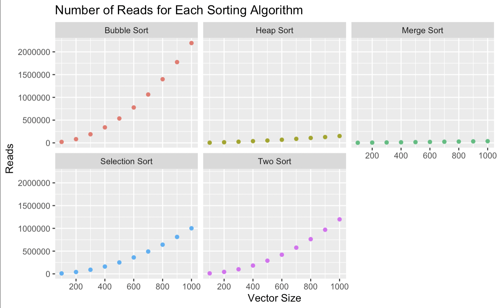
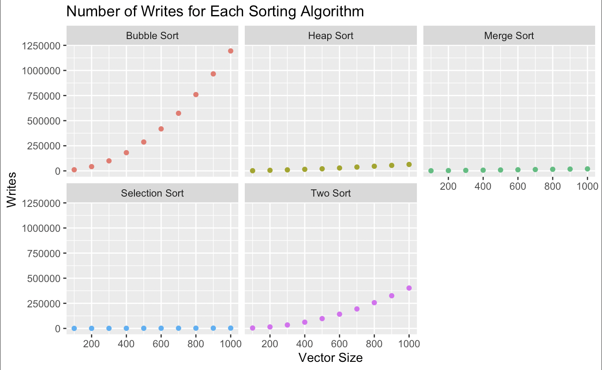
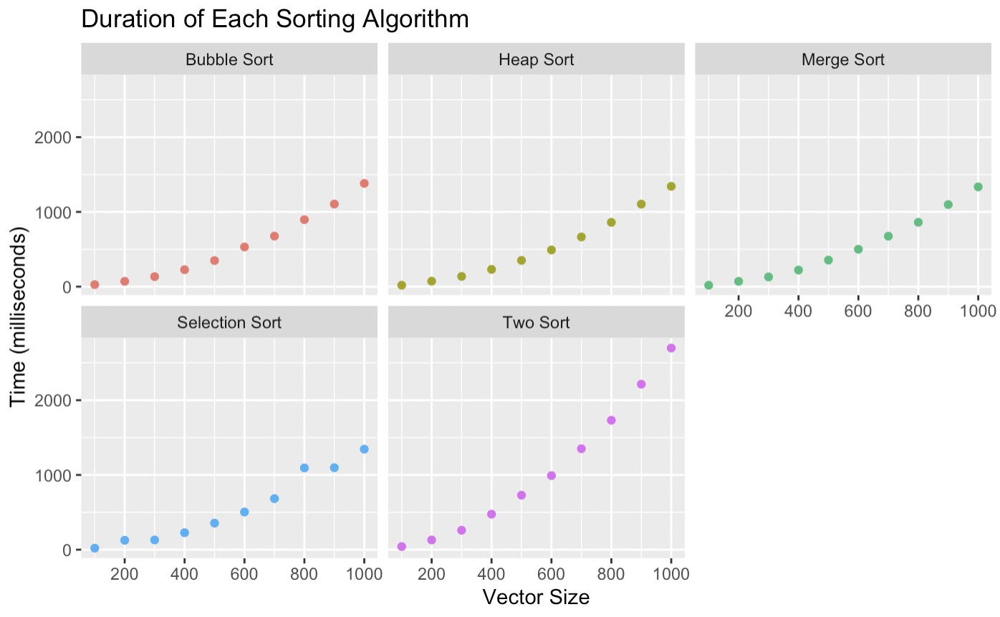

# Sorting Algorithm Analysis

This project sorts 1000 objects from a Spotify Songs data set by the number of days since their release. The number of reads (the number of times a Comparable object is used) and writes (the number of times a Comparable object is assigned into) as well as the time required to complete each sorting algorithm is recorded and graphed.

Sorting algorithms:
1. Bubble Sort
2. Selection Sort
3. Merge Sort
4. Heap Sort
5. Two-sort: sort by insertion sort twice on two different fields (days since release and charts position). 

## Report

This data set contains the top 1000 streamed songs on Spotify. The fields are position in the rankings, artist, song title, number of days since release, and number of streams.

Merge sort was the most consistent and efficient sorting algorithm when comparing the number of reads as the vector size increased. It had the lowest number of reads for each vector size as well as the lowest percentage increase from a vector size of 100 to 1000 with a 1463% increase. The next lowest percent increase as vector size increased was heap sort with a 3451% increase in reads. The least efficient algorithm was bubble sort with a 10358% increase in reads and the highest number of reads for every vector size.
Selection sort had the lowest number of reads for each vector size, and both merge and selection sort had very minimal increases in writes compared to the rest of the algorithms. Selection sort had a 909% increase in writes from 100 to 1000 items, and merge sort had a 1385% increase. Bubble sort again had the highest number and percentage increase in writes with an increase of 10675%.
Overall, merge sort seems to be the most efficient algorithm of those I analyzed for minimizing reads and writes for larger vectors. It has O(N log N) time complexity and O(N) auxiliary complexity which is a time vs memory tradeoff when compared with bubble and insertion sort which have O(N^2) time complexity and O(1) auxiliary complexity. Merge sort takes less time but requires more memory. 

The time differences among the sorting algorithms were much less significant than the number of reads and writes and the graphs look relatively similar, besides two sort which makes sense since it has to run insertion sort twice. All of the algorithms besides two sort took less than 1500 milliseconds to complete when the vector had 1000 items.